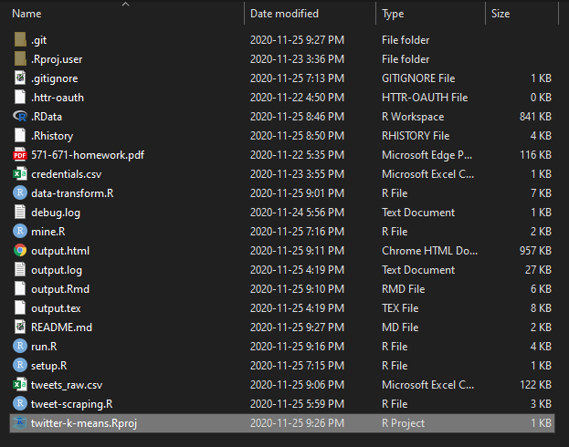
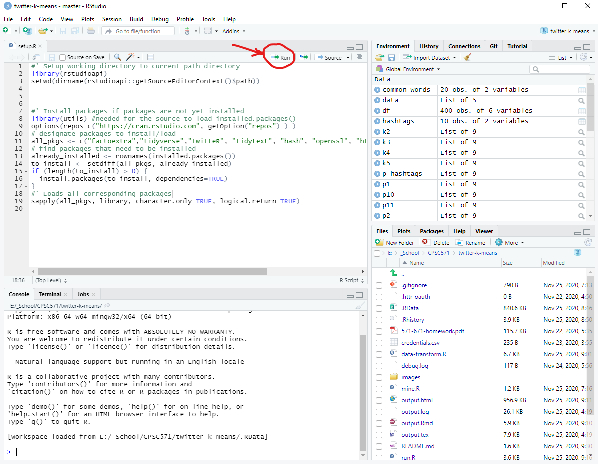
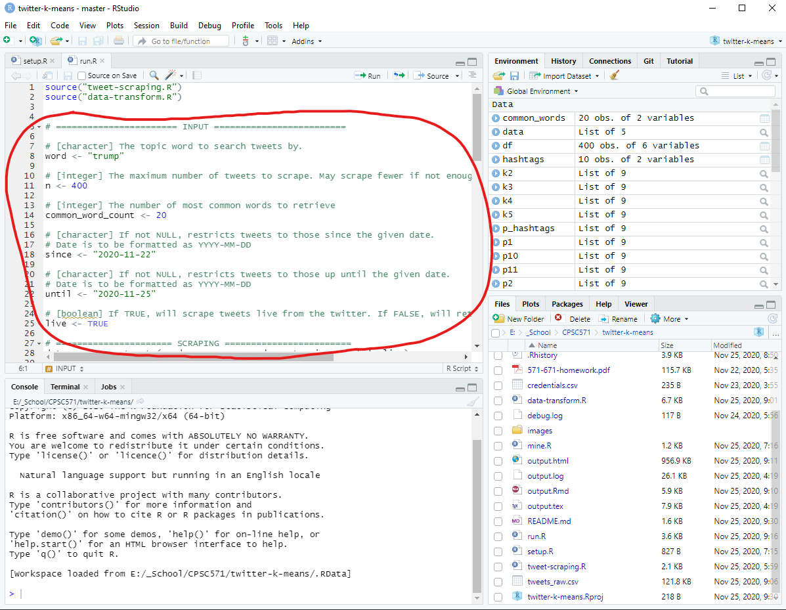
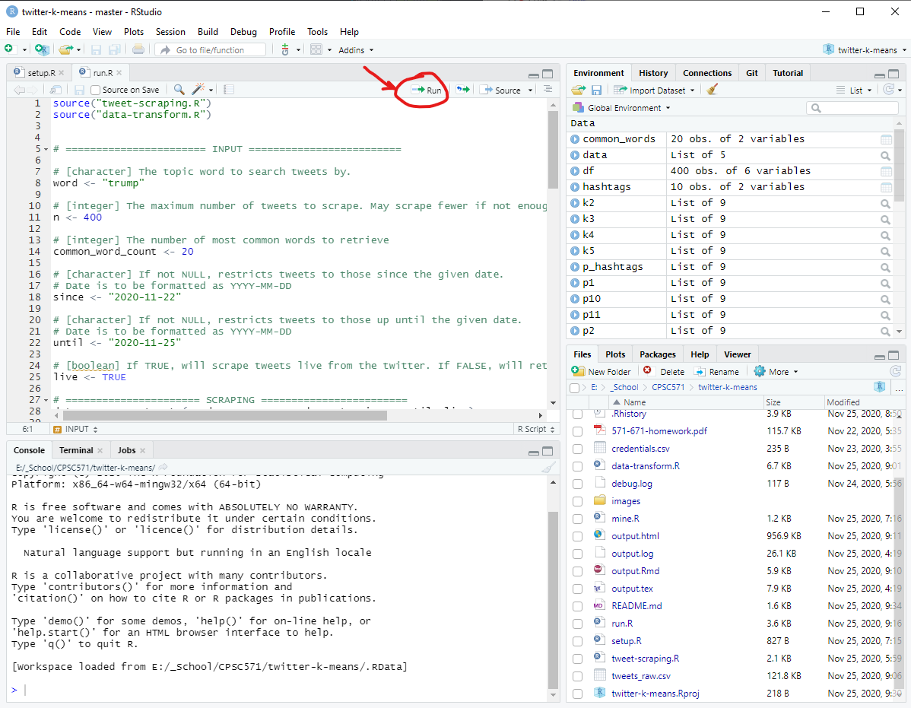

# twitter-k-means

## Requirements

This program requires R and RStudio, which can be downloaded and installed
through the following links:

### R

- <https://www.r-project.org/>

### RStudio

- <https://rstudio.com/products/rstudio/download/>

### Twitter Credentials

In order to connect to the Twitter API to scrape live twitter data:

- Place `credentials.csv` at the root directory of the repository.

## Setup

1. Open the project, by clicking on `twitter-k-means.Rproj`.

2. Run `setup.R`.

    - This will install and load all prerequisite libraries needed.

3. Set the input values for `run.R` at the top of the file.

    - word
        - character The topic word to search tweets by.
    - n
        - The maximum number of tweets to scrape. May scrape fewer if not enough tweets match the topic.
    - common_word_count
        - The maximum number of tweets to scrape. May scrape fewer if not enough tweets match the topic.
    - since
        - If not NULL, restricts tweets to those since the given date. Date is to be formatted as YYYY-MM-DD.
    - until
        - If not NULL, restricts tweets to those up until the given date. Date is to be formatted as YYYY-MM-DD
    - live
        - If TRUE, will scrape tweets live from the twitter. If FALSE, will retrieve tweet data from tweets_raw.csv.

4. Run `run.R` and observe results.

## Visual Output

If you prefer to just see our results without running `setup.R` and `run.R`, you can open the `output.html` file and see our resulting plots.
